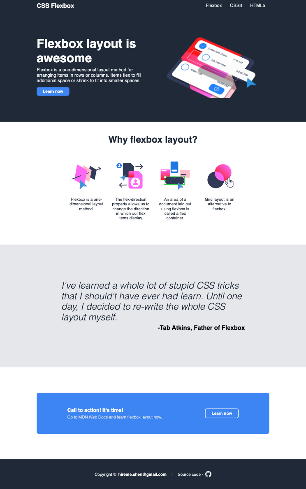

# Flexbox Landing Page
   

A static landing page using flexbox layout. If you are learning flexbox layout, this is a quite good tiny-project to get your hands dirty.

You can either start from very scratch, or imitate this example. If you have any questions, feel free to leave some comments in `issues`. 

If you like my work, star this repo, it would be very much appreciated.

Enjoy coding!

## Credits
* Idea: [Odin Project](https://www.theodinproject.com/paths/foundations/courses/foundations/lessons/landing-page)
* Images: [Adobe XD](https://www.adobe.com/ca/products/xd.html)